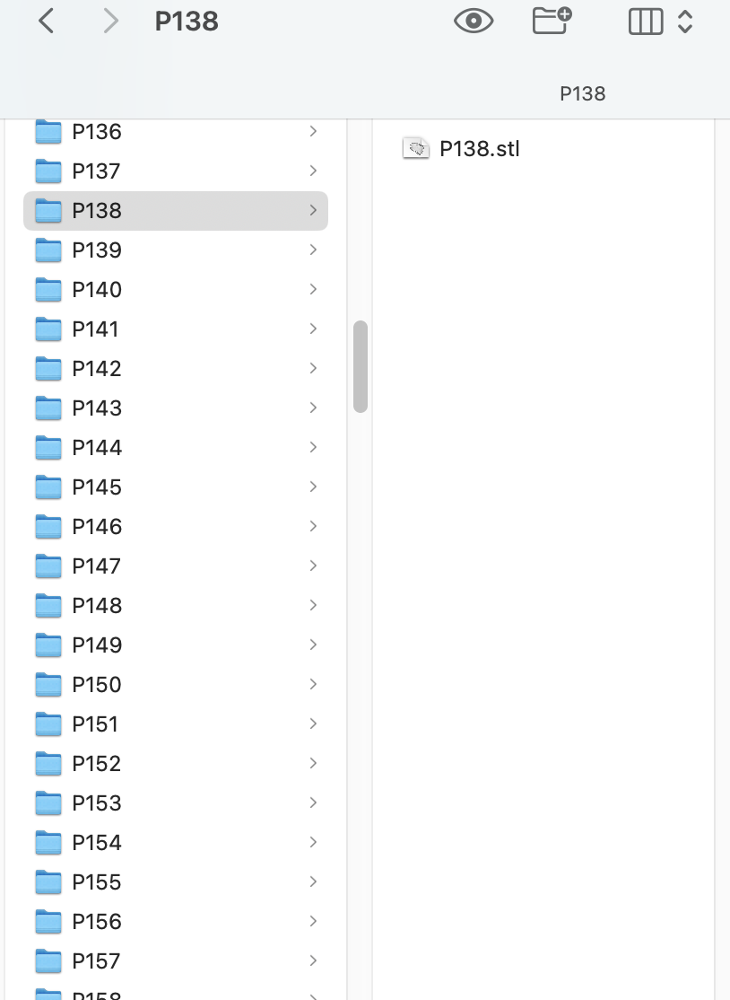

# Folder File Renamer

This Python script is designed to streamline the process of renaming files within a directory structure. It iterates through each subfolder, identifies files, and renames them based on the parent folder's name. The new file names are formed by appending the folder name and preserving the original file extension. This script is useful for organizing and standardizing file names in scenarios where each file should be associated with its parent folder.

# Usage:

Replace "/path/to/your/directory" with the actual path to your root directory.
Execute the script to automatically rename files in each subfolder.

